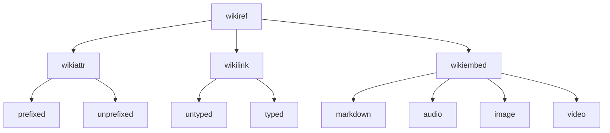

# wikirefs-spec

](https://img.shields.io/badge/%F0%9F%8E%8B-A%20WikiBonsai%20Project-brightgreen)
[](https://npmjs.org/package/wikirefs-spec)

WikiRefs refers to several wiki constructs that all fall under the umbrella "wikiref" and generally include the `[[double square bracket]]` syntax in some way.

- WikiRefs
  - [WikiAttrs](#wikiattrs)
  - [WikiLinks](#wikilinks)
  - [WikiEmbeds](#wikiembeds)

This project expects:

- The text that appears between square brackets should match a filename from a given collection of markdown files (e.g. `[[filename]]` -> `filename.md`).
- Whitespace is supported in filenames, though it is not preferred.
- Matching between `[[wikirefs]]` and filenames is case insensitive.
- The file's `title` metadata is what gets rendered to the anchor (`a`) tag's inner text. If no title exists, the filename is used instead.

This project's implementation does not enforce the following, but downstream projects in the [`WikiBonsai` project](https://github.com/wikibonsai/wikibonsai) do:

- Filenames in a collection of markdown files are expected to be unique. (This is in part to keep the specification a touch simpler. If full file paths are desired, try using traditional `[markdown](links)` instead)

## Use

Below is an example usage of the test cases provided by `wikirefs-spec`:

```js
import assert from 'node:assert/strict';
import { wikiAttrCases, wikiLinkCases, wikiEmbedCases } from 'wikirefs-spec';

function run(contextMsg: string, tests: TestCase[]): void {
  context(contextMsg, () => {
    for(const test of tests) {
      it(test.descr, () => {
        const expdHTML: string = test.html;
        const actlHTML: string = md.render(test.mkdn, env);
        assert.strictEqual(actlHTML, expdHTML);
      });
    }
  });
}

describe('render wikirefs; mkdn -> html', () => {

  run('wikiattr test cases', wikiAttrCases);
  run('wikilink test cases', wikiLinkCases);
  run('wikiembed test cases', wikiEmbedCases);

});
```

## WikiAttrs

**"Wikiattrs"** are block constructs whose content is the only content on a given line. They are identical to typed wikilinks except they expect a newline after the closing square brackets `]]`. They may be located anywhere in a markdown file, but are collected and rendered at the top of the file (if so desired), much like how footnotes are collected and rendered at the bottom of a markdown file. (Generated HTML is reminiscent of wikipedia-style info boxes and can be turned off in the scenario where only metadata is desired).

Wikiattrs are meant to be compatible with [caml](https://github.com/wikibonsai/caml) metadata attributes.

Wikiattrs do not support labels.

### Single

All of the following examples should generate the same html:

```markdown
:attrtype::[[filename]]

Some more text.

```

```markdown
Some more text.

:attrtype::[[filename]]

```

(Optional colon prefixes)

```markdown
attrtype::[[filename]]

Some more text.

```

Resulting HTML:

```html
<aside class="attrbox">
  <span class="attrbox-title">Attributes</span>
    <dl>
      <dt>attrtype</dt>
        <dd><a class="attr wiki reftype__attrtype" href="/tests/fixtures/fname-a" data-href="/tests/fixtures/fname-a">title a</a></dd>
    </dl>
</aside>
<p>Some more text.</p>
```

### List

Lists are also supported. All of the following examples should generate the same html:

Comma-separated lists.

```markdown
:attrtype::[[fname-a]], [[fname-b]], [[fname-c]]
```

Markdown-style bullet lists.

```markdown
:attrtype::
- [[fname-a]]
- [[fname-b]]
- [[fname-c]]
```

```markdown
:attrtype::
+ [[fname-a]]
+ [[fname-b]]
+ [[fname-c]]
```

```markdown
:attrtype::
* [[fname-a]]
* [[fname-b]]
* [[fname-c]]
```

```markdown
:attrtype::
- [[fname-a]]
+ [[fname-b]]
* [[fname-c]]
```

Optional colon prefix.

```markdown
attrtype::
- [[fname-a]]
- [[fname-b]]
- [[fname-c]]
```

Flexible whitespace.

```markdown
: attrtype ::
              - [[fname-a]]
              - [[fname-b]]
              - [[fname-c]]
```

Resulting HTML:

```html
<aside class="attrbox">
  <span class="attrbox-title">Attributes</span>
    <dl>
      <dt>attrtype</dt>
        <dd><a class="attr wiki reftype__attrtype" href="/tests/fixtures/fname-a" data-href="/tests/fixtures/fname-a">title a</a></dd>
        <dd><a class="attr wiki reftype__attrtype" href="/tests/fixtures/fname-b" data-href="/tests/fixtures/fname-b">title b</a></dd>
        <dd><a class="attr wiki reftype__attrtype" href="/tests/fixtures/fname-c" data-href="/tests/fixtures/fname-c">title c</a></dd>
        <!-- etc. -->
    </dl>
</aside>
```

Lists also support flexible whitespacing: Attrtype text may be prefixed (between first colon `:` and attrtype text) or suffixed (between attrtype text and double colon `::`) by one space. List item prefix whitespace (space before the bullet `-*+`) can have any number of spaces.

The result allows for pretty-printed wikiattrs:

```markdown
: type             :: [[fname-a]]
: med-type         :: 
                      - [[fname-b]]
                      - [[fname-c]]
: longer-type-text :: 
                      - [[fname-d]]
                      - [[fname-e]]
                      - [[fname-f]]
```

## WikiLinks

**"Wikilinks"** are inline constructs similar to regular text or links which appear in and alongside other markdown constructs like bold, lists, or tables. They are rendered in-place and as links to other content, especially content within the local context.

#todo

Note: In a markdown context, when talking about the different kinds of wiki constructs (wikiattr, wikilink, wikiembed) "wikilink" refers to the description herein. However, in an HTML context, a wikilink is any anchor (`a`) tag that was generated by the wikirefs plugin. Thus, anchors typically will have the `wikilink` class and other css classes describing how that wikilink came to be:

- wikiattr -> `<a class="attr wiki" ...`
- typed wikilink -> `<a class="wiki link typed" ...`
- untyped wikilink -> `<a class="wiki link" ...`
- wikiebed -> `<a class="wiki embed" ...`

### Untyped

An untyped wikilink should link to another markdown file from a given collection of markdown files. It should render as an anchor tag, where the anchor tag's `href` property points to the markdown file's `url` and the anchor's `innertext` is probably title text generated from the file's metadata. A `data-href` mirroring the `href` will also be added.

If provided, the markdown file's `doctype` may also be added as a css class to the anchor tag.

Markdown:

```markdown
[[filename]]
```

Resulting HTML:

```html
<a class="wiki link" href="url" data-href="url">title</a>
```

### Typed

A typed wikilink is a wikilink with linktype information. It should render similarly to untyped wikilinks, with the addition of a `type` css class to indicate it is a typed wikilink and a css classname that matches the name of the given linktype prefixed with `reftype__`.

Markdown:

```markdown
:linktype::[[filename]]
```

Resulting HTML:

```html
<a class="wiki link type reftype__linktype" href="url" data-href="url">title</a>
```

### Labelled

When labelled, labelled text (text which appears after the `|` and before the `]]`) will render for the wikilink's anchor text instead of, likely, the file's title.

Markdown:

```markdown
[[filename|label]]
```

Resulting HTML:

```html
<a class="wiki link" href="url" data-href="url">label</a>
```

Labels also work for typed wikilinks.

Markdown:

```markdown
:linktype::[[filename|label]]
```

Resulting HTML:

```html
<a class="wiki link type reftype__linktype" href="url" data-href="url">label</a>
```

## WikiEmbeds

**WikiEmbeds** are also inline constructs, but render as blocks. They provide links to the linked content, but also embed the file's actual content in the current file when rendered. Markdown files, audio, images, and video are all supported.

### Markdown

File with wikiembed:

```markdown
![[filename]]
```

File to be embedded:

```markdown
Here is some content.
```

Resulting HTML:

```html
<p>
  <div class="embed-wrapper">
    <div class="embed-title">
      <a class="wiki embed" href="/tests/fixtures/embed-doc" data-href="/tests/fixtures/embed-doc">
        embedded document
      </a>
    </div>
    <div class="embed-link">
      <a class="embed-link-icon" href="/tests/fixtures/embed-doc" data-href="/tests/fixtures/embed-doc">
        <i class="link-icon"></i>
      </a>
    </div>
    <div class="embed-content">
      <p>Here is some content.</p>
    </div>
  </div>
</p>
```

### Audio

```markdown
![[audio.mp3]]
```
Resulting HTML:

```html
<p>
  <span class="embed-media" src="audio.mp3" alt="audio.mp3">
    <audio class="embed-audio" controls src="/tests/fixtures/audio.mp3"></audio>
  </span>
</p>
```

Supported audio formats: `.mp3`, `.webm`, `.wav`, `.m4a`, `.ogg`, `.3gp`, `flac`. (See const.ts)

### Image

```markdown
![[image.png]]
```

Resulting HTML:

```html
<p>
  <span class="embed-media" src="image.png" alt="image.png">
    
  </span>
</p>
```

Supported image formats: `.png`, `.jpg`, `.jpeg`, `.gif`, `.psd`, `.svg`, `.tif`, `.tiff`, `.apng`, `.avif`, `.jfif`, `.pjepg`, `.pjp`, `.webp`, `.bmp`, `.ico`, `.cur`. (See const.ts)


### Video

```markdown
![[video.mp4]]
```

Resulting HTML:

```html
<p>
  <span class="embed-media" src="video.mp4" alt="video.mp4">
    <video class="embed-video" controls src="/tests/fixtures/video.mp4"></video>
  </span>
</p>
```

Supported video formats: `.mp4`, `.mov`, `.wmv`, `.flv`, `.avi`, `.mkv`, `.ogv`. (See const.ts)

## `doctype`

If a document type (`doctype`) for the referenced markdown file is given, its slugified form will be added as a css class -- for a markdown file with a doctype called `doctype`:

#### `WikiAttr`

```html
<aside class="attrbox">
  <span class="attrbox-title">Attributes</span>
    <dl>
      <dt>attrtype</dt>
        <dd><a class="attr wiki reftype__attrtype doctype__doctype" href="/tests/fixtures/fname-a" data-href="/tests/fixtures/fname-a">title a</a></dd>
        <!-- etc. -->
    </dl>
</aside>
```

#### `WikiLink`

##### Typed

```html
<a class="wiki link reftype__linktype doctype__doctype" href="url" data-href="url">title</a>
```

##### Untyped

```html
<a class="wiki link doctype__doctype" href="url" data-href="url">title</a>
```

#### `WikiEmbed`

```html
<p>
  <div class="embed-wrapper">
    <div class="embed-title">
      <a class="wiki embed doctype__doctype" href="/tests/fixtures/embed-doc" data-href="/tests/fixtures/embed-doc">
        embedded document
      </a>
    </div>
    <div class="embed-link">
      <a class="embed-link-icon" href="/tests/fixtures/embed-doc" data-href="/tests/fixtures/embed-doc">
        <i class="link-icon"></i>
      </a>
    </div>
    <div class="embed-content">
      <p>Here is some content.</p>
    </div>
  </div>
</p>
```

## Tests

For more on syntax, see the [test cases](https://github.com/wikibonsai/wikirefs/tree/main/spec/cases).

#### Test Case Structure



## Customization

Sometimes certain aspects of a spec test do not match target expectations. They can be altered in a test suite in the following manner -- this example is taken from [markdown-it-wikirefs](https://github.com/wikibonsai/markdown-it-wikirefs):

```js
import { wikiRefCases } from 'wikirefs-spec';

describe('markdown-it-wikirefs', () => {

  before(() => {
    // markdown-it implements...
    wikiRefCases.forEach((testcase: WikiRefTestCase) => {
      // ...gfm strikethroughs differently by...
      if (testcase.descr.includes('gfm')
      && testcase.descr.includes('strikethrough')) {
        // ...using '<s>' instead of '<del>'
        testcase.html = testcase.html.replace(/del>/g, 's>');
      }
    });
  });

  // run tests...

});
```

Before running (inside the `before`), all test cases are looped through and changed by filtering tests by the `descr` and then applying the desired change to the test case's `html` -- or `mkdn` if so desired.
